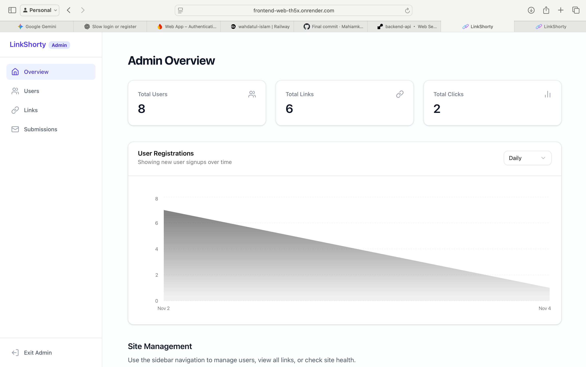
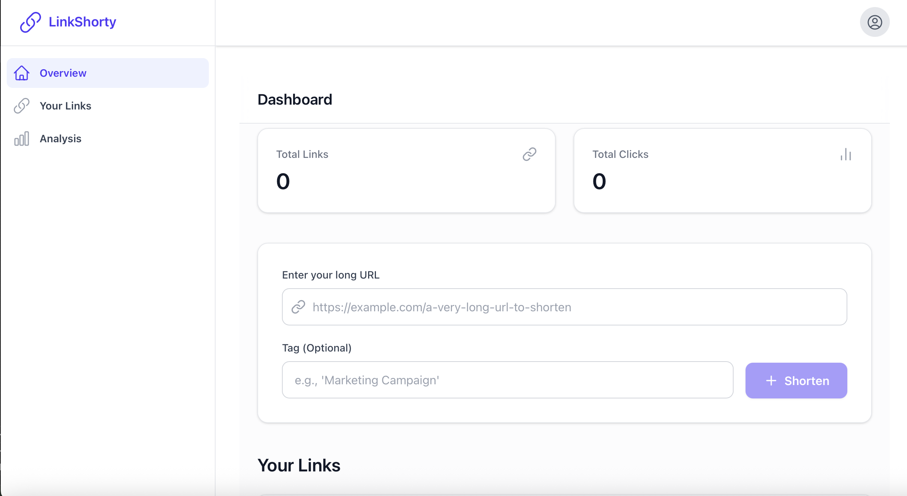
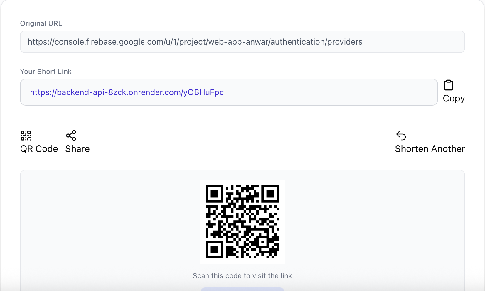

LinkShorty: Full-Stack Link Shortener

LinkShorty is a high-performance, full-stack link shortening service built with a modern monorepo architecture. It features a Next.js (React) frontend, a FastAPI (Python) backend, and a complete user authentication system with email verification, Google Sign-In, and a full admin dashboard.

This repository is a comprehensive example of a production-ready web application, demonstrating best practices in API design, database management, user authentication, and secure deployment.

## Screenshots

### Main Admin Dashboard

### Main User Dashboard

### Main landingpage

### Sample on how to shorten link

*Figure: Main dashboard screenshot.*

✨ Core Features

This application is more than just a simple shortener. It includes a complete suite of features for a modern SaaS application:

Complete User Authentication:

Email/Password Registration

Secure JWT-based Login

Email Verification: New users are sent a validation email via SendGrid.

Google OAuth 2.0: One-click login and registration with Firebase Auth.

Link Management:

Create, view, and delete short links.

View detailed click analytics for each link.

Secure Admin Dashboard:

Protected admin-only routes.

User Management: View all registered users.

Submission Management: View and delete all messages from the contact form.

Production-Ready API:

Rate Limiting: Protects against abuse on login, register, and redirect routes.

CORS: Securely configured to allow requests from the deployed frontend.

Dependency Injection: Cleanly manages database sessions and user auth.

Contact Form: A full-featured contact page that saves submissions to the database.

🚀 Tech Stack

This project uses a modern monorepo structure to manage the frontend and backend code in one repository.

Area

Technology

Purpose

Frontend

Next.js 14 (React)

App Router, SSR, and client-side UI

TypeScript

For type-safe frontend code

Tailwind CSS

For rapid, utility-first styling

Backend

FastAPI (Python)

High-performance API development

Pydantic

Data validation and settings management

SQLAlchemy

ORM for database interaction

slowapi

Rate limiting for API endpoints

Database

MySQL

(Can be run in Docker or hosted on Railway/PlanetScale)

Auth & Email

Firebase Auth

Handles Google OAuth 2.0 sign-in

SendGrid

For sending verification and welcome emails

JWT (PyJWT)

For secure, stateless session management

Infra

Docker / Docker Compose

For easy local development and containerization

Render

Production hosting for both frontend and backend services

🏁 Getting Started (Local Development)

The easiest way to run this entire project (frontend, backend, and database) on your local machine is with Docker.

Prerequisites

Git

Docker

Docker Compose

A Firebase Project (to get your serviceAccountKey.json)

A SendGrid Account (to get your SENDGRID_API_KEY)

1. Clone the Repository

git clone [https://github.com/mahiamk/link-shortener.git](https://github.com/mahiamk/link-shortener.git)
cd link-shortener

2. Set Up Environment Variables

This is the most important step. You need to create .env files for both the backend and frontend.

Backend (apps/api/.env)

Create a file at apps/api/.env.

Go to your Firebase Project Settings > Service Accounts and click "Generate new private key".

Rename the downloaded file to serviceAccountKey.json and place it in the apps/api/ folder.

Copy the content below into your .env file and fill in your secrets.

# /apps/api/.env

# This URL *must* match the service name in docker-compose.yml
DATABASE_URL="mysql+pymysql://user:password@db/link_db"

# Generate a strong, random string (e.g., openssl rand -hex 32)
JWT_SECRET="YOUR_SUPER_STRONG_JWT_SECRET_KEY"

# Your SendGrid API Key (from the SendGrid dashboard)
SENDGRID_API_KEY="SG.your_sendgrid_key_here"

# The email you verified as a "Single Sender" in SendGrid
FROM_EMAIL="your-verified-email@example.com"

# This *must* point to the key file *inside the Docker container*
# The docker-compose file (see below) will mount it here.
GOOGLE_APPLICATION_CREDENTIALS="/code/serviceAccountKey.json"

Frontend (apps/web/.env.local)

Create a file at apps/web/.env.local.

Copy the content below into it. This tells your Next.js app to talk to your FastAPI backend, which will be running on port 8000.

# /apps/web/.env.local

NEXT_PUBLIC_API_URL="http://localhost:8000"
NEXT_PUBLIC_BASE_URL="http://localhost:8000"

3. Run with Docker Compose

Use the provided docker-compose.yml file (see the corrected version in the other tab). This file is configured for hot-reloading, so any code changes you make will automatically restart the servers.

docker-compose up -d --build

Your services are now running:

Frontend: http://localhost:3000

Backend: http://localhost:8000/docs

Database: Accessible on localhost:3306

4. Bootstrap Your Admin Account

Your app is running, but no one is an admin.

Go to http://localhost:3000 and sign up for a new account.

Click the verification link in your email.

Open a terminal and run this Docker command to connect to the database CLI and promote your user:

# Make sure to replace with your email
docker-compose exec db mysql -uuser -ppassword link_db -e "UPDATE users SET is_superuser = 1 WHERE email = 'your-email@gmail.com';"

Log out and log back in. You will now have access to the /admin dashboard.

🚀 Deployment

This project is configured for production deployment on Render (for services) and Railway (for the database).

1. Backend API (FastAPI)

Service: Render Web Service

Repository: Your GitHub repo

Root Directory: apps/api

Build Command: pip install -r requirements.txt

Start Command: uvicorn app.main:app --host 0.0.0.0 --port $PORT

Environment Variables: Add all variables from your apps/api/.env file, updating DATABASE_URL to your live Railway MySQL string.

Secret File: Add serviceAccountKey.json with its contents. Set GOOGLE_APPLICATION_CREDENTIALS to /etc/secrets/serviceAccountKey.json.

2. Frontend Web (Next.js)

Service: Render Web Service

Repository: Your GitHub repo

Root Directory: apps/web

Build Command: npm install && npm run build

Start Command: npm start

Environment Variables:

NEXT_PUBLIC_API_URL: Your live backend URL (e.g., httpss://your-api.onrender.com)

3. Post-Deploy Configuration

CORS: Add your live frontend URL (e.g., httpss://your-web.onrender.com) to the allow_origins list in your apps/api/app/main.py file.

Firebase Auth: Add your live frontend URL to the "Authorized domains" list in your Firebase project settings.

Set Admin: Connect to your live Railway database and run the UPDATE users... command from Step 4 above to promote your account.

📂 Project Structure

This project uses a monorepo structure to keep the frontend and backend codebases separate but in one repository.

/link-shortener
│
├── .github/              # (Optional: CI/CD workflows)
│
├── apps/
│   ├── api/              # FastAPI Backend
│   │   ├── app/            # Main application source code
│   │   │   ├── core/       # Config, security, email, limiter
│   │   │   ├── db/         # Database models, schemas, session
│   │   │   ├── endpoints/  # API routers (auth, links, admin, etc.)
│   │   │   ├── crud.py     # Database logic
│   │   │   └── main.py     # Main FastAPI app
│   │   ├── requirements.txt
│   │   └── Dockerfile
│   │
│   └── web/              # Next.js Frontend
│       ├── app/            # Next.js App Router (all pages)
│       │   ├── (admin)/    # Admin layout and pages
│       │   ├── (dashboard)/# User dashboard layout and pages
│       │   ├── contact/
│       │   ├── login/
│       │   └── ...
│       ├── components/     # Reusable React components
│       ├── lib/            # Helper functions (e.g., api.ts)
│       ├── package.json
│       └── Dockerfile
│
├── docker-compose.yml    # For local development
└── README.md             # You are here!

📜 License

This project is licensed under the MIT License. See the LICENSE file for details.